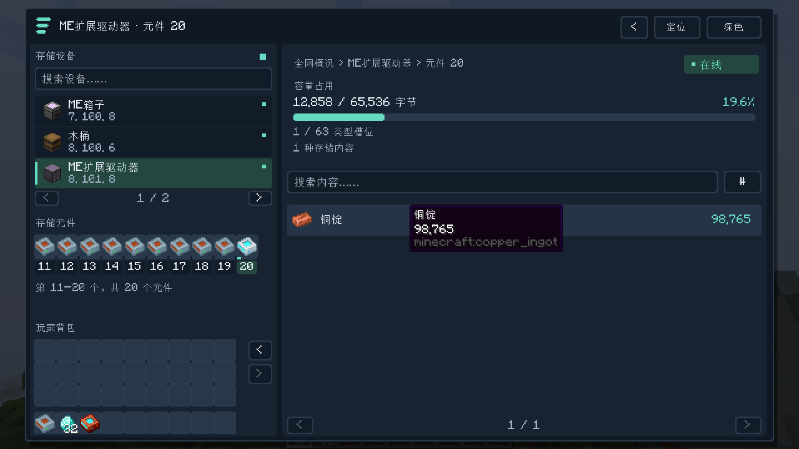

# 0.2.0 开发与验收记录 / Development and validation

本文件记录第二轮迭代。首版 0.1.0 的既有测试证据保留在 [TEST_REPORT.md](TEST_REPORT.md)，不将旧版通过情况自动视为新版通过。

This document tracks the second iteration. Existing 0.1.0 evidence remains in [TEST_REPORT.md](TEST_REPORT.md); those results do not automatically validate 0.2.0.

## 本轮范围 / Scope

- 现代仪表盘界面，提供深色／浅色外观切换。
- ExtendedAE 扩展 ME 驱动器的元件识别和管理适配。
- 扩展真实存储总线与不同容器的测试覆盖，包括双箱与有方向限制的容器。

Modern dashboard with light/dark appearance; ExtendedAE expanded-drive support; broader real storage-bus coverage, including double chests and sided containers.

## 已完成的自动验收 / Completed automated validation

日期：2026-09-30（Asia/Shanghai）。运行环境：Java 17、Minecraft 1.20.1、Forge 47.4.0、AE2 15.4.10、GuideME 20.1.7，以及实际安装的 **ExtendedAE 1.20-1.4.21-forge、Glodium 1.20-1.5-forge**。

日志 `work/v020-eae-tests.log` 最终记录 `BUILD SUCCESSFUL` 与全部 **11 项必需 GameTests 通过**，没有附属用例跳过标记。JUnit XML 记录 **5 项测试、0 失败、0 错误、0 跳过**。这是开发环境中的真实服务端测试，不是对所有整合包的兼容保证。

On 2026-09-30 (Asia/Shanghai), the Java 17 / Minecraft 1.20.1 / Forge 47.4.0 / AE2 15.4.10 / GuideME 20.1.7 environment included real ExtendedAE 1.20-1.4.21-forge and Glodium 1.20-1.5-forge installations. The run finished successfully with **11 required GameTests passed and no addon skips**. JUnit recorded **5 tests, zero failures, errors or skips**. These are actual development-server checks, not a guarantee for every modpack.

`BusCompatibilityGameTests` 创建真实且有能源的 AE 网络、真实线缆与 AE 存储总线，在 AE 网络实际暴露预期内容后，再验证扫描器的内容与容量；未使用伪造库存替代 AE 总线。

`BusCompatibilityGameTests` creates real powered AE grids, cables and storage buses. It waits for the expected live AE network contents before validating scanner contents and capacity. It does not substitute fake inventories for AE storage buses.

| 用例 / Case | 核对内容 / Assertions | 当前状态 / Status |
|---|---|---|
| 双箱 / Double chest | 近侧 13 金锭、远侧末槽 41 钻石；2/54 槽位；不重复计数 / Near/far quantities and 2/54 slots | 通过 / Passed |
| 漏斗 / Hopper | 29 铜锭、末槽 3 绿宝石；2/5 槽位 / Exact quantities and 2/5 slots | 通过 / Passed |
| 熔炉顶部 / Furnace top | 仅输入方向；1 个可见槽位 / Input face and one physical slot | 通过 / Passed |
| 熔炉底部 / Furnace bottom | 输出方向；2 个物理槽位；内容受提取规则限制 / Output face, two physical slots, extraction restrictions | 通过 / Passed |
| 熔炉侧面 / Furnace side | 仅燃料方向；1 个可见槽位 / Fuel face and one physical slot | 通过 / Passed |
| ExtendedAE Ingredient Buffer | 通过真实存储总线核对 23,456 mB 与流体接口总容量 / Live bus exposes 23,456 mB; capacity matches actual fluid handler | 通过 / Passed |
| ExtendedAE 第 20 个元件 / Twentieth cell | 20 个槽位、12,345 铁锭、字节与类型、实际第 20 槽交换和移除设备失效 / Slot addressing, exact contents/capacity, real swaps and stale-access rejection | 通过 / Passed |
| ExtendedAE 三种存储总线 / Three bus variants | 标签、模组、精确总线；每条可见 37 铁锭；不绕过过滤；物理 2/27 槽；目标名称、位置与连接面 / Tag/mod/precise bus filtering, capacity and target metadata | 通过 / Passed |
| AE 原版元件及木桶回归 / Original AE cells and barrel | 2 项：12,345 铁锭、23,456 mB、元件保存、ME 箱子输入隔离、木桶 37 金锭及 1/27 槽 / Two original live-storage regression cases | 通过 / Passed |
| 空 ME 能力的回退 / Null ME-capability fallback | ME 能力返回空值时继续读取物理存储接口 / Physical-handler fallback when the ME capability is empty | 通过 / Passed |

流体测试使用真实 ExtendedAE `expatternprovider:ingredient_buffer` 方块，通过它的 Forge 流体接口填充，再由真实 AE 存储总线读取。在未安装 ExtendedAE 的基础环境中，此项明确记录 `SKIPPED` 并结束，不能将该基础环境的成功总数作为附属兼容证据。

The fluid case fills the real ExtendedAE `expatternprovider:ingredient_buffer` through its Forge fluid handler, then reads it through a real AE storage bus. Without ExtendedAE, it logs `SKIPPED` and finishes; the base-environment success count must not be treated as addon compatibility evidence.

## 基础环境及客户端 / Baseline and client

无 ExtendedAE／Glodium 环境的 `work/v020-baseline-build.log` 记录正常构建成功，5 项 JUnit 通过。Forge 汇总显示 11 项成功，其中 **8 项实际执行，3 项因缺少附属明确跳过**；这三项的兼容证据来自上方安装实际附属的测试运行。正式 JAR 已检查，不含游戏测试类、客户端冒烟测试入口、测试空结构或捆绑的 ExtendedAE 类；必需依赖仍为 Forge、Minecraft 和 AE2。

The addon-absent build succeeded with five passing unit tests. Its eleven GameTest completions consist of **eight executed cases and three explicitly skipped addon cases**. The addon cases were actually executed in the separate addon-enabled run above. The production JAR was checked to exclude GameTest classes, the client smoke harness, the empty test structure and bundled ExtendedAE classes; its required dependencies remain Forge, Minecraft and AE2.

实际中文单人开发客户端以 1280×720 启动，在 GUI 缩放 2 与 3 下完成十张截图。`work/v020-client.log` 及归档的 [客户端结果](screenshots/v0.2.0/client-smoke-result.txt) 记录以下通过项：

- 普通驱动器第 1 槽经客户端普通取出、放回、Shift 取出、Shift 放回，保持一个元件及 **12,345 铁锭**。
- ExtendedAE 第 20 槽通过第二页可见槽位 9 操作，同样四次取放后保持一个元件及 **98,765 铜锭**，没有落入其他槽位。
- 中文“铜锭”搜索返回精确数量，清除搜索后内容恢复。
- 快速 A → B → A 切换期间阻止远程槽位操作，收到最终同步后恢复可操作状态。
- 流体详情保留 **23,456 mB 水**；外部木桶保留 **37 绿宝石和 1/27 槽位**。
- 深色、浅色与紧凑布局实际截图已检查；重点检查扩展驱动器第二页及紧凑窗口，未发现阻碍使用的重叠、裁切或对比度问题。

The actual Chinese-language integrated client ran at 1280×720 with GUI scales 2 and 3. It verified normal and Shift transfers through vanilla client packets, preserving one cell with 12,345 iron in the ordinary drive and one cell with 98,765 copper in ExtendedAE slot twenty. Localized copper search, rapid A → B → A navigation locking/unlocking, exact fluid amounts and external-container capacity passed. Ten real captures were reviewed, including expanded-drive and compact views in both themes.

## 实际截图 / Actual screenshots



[浅色主题第 20 个元件](screenshots/v0.2.0/smoke-light-expanded-cell20.png) · [紧凑深色](screenshots/v0.2.0/smoke-compact-dark.png) · [紧凑浅色](screenshots/v0.2.0/smoke-compact-light.png)

[深色全网](screenshots/v0.2.0/smoke-dark-network.png) · [浅色全网](screenshots/v0.2.0/smoke-light-network.png) · [驱动器](screenshots/v0.2.0/smoke-dark-drive.png) · [普通元件](screenshots/v0.2.0/smoke-dark-cell.png) · [流体](screenshots/v0.2.0/smoke-dark-fluid.png) · [外部容器](screenshots/v0.2.0/smoke-dark-external.png)

## 未验证范围 / Remaining limits

双客户端并发、领地保护、大型整合包压力和未列出的第三方容器／元件尚未验证；本轮未重新视觉验收世界高亮。测试运行使用开发环境，没有在用户原有整合包中安装运行。

Concurrent multiplayer, claim protection, large-modpack performance and unlisted third-party containers/cells remain unverified. World-highlighting visuals were not rechecked this iteration. Tests used development environments, not the user's existing modpack.

## 附属来源与复现 / Addon sources and reproduction

本次测试使用作者发布的 [ExtendedAE 1.20-1.4.21-forge](https://github.com/GlodBlock/ExtendedAE/releases/tag/1.20-1.4.21-forge) 与 [Glodium 1.20-1.5-forge](https://modrinth.com/mod/glodium/version/eoUaDkZf)。二者是可选兼容测试依赖，不是使用本模组的必需依赖，也未合并进本模组 JAR。

The run used the authors' releases linked above. They are optional compatibility-test dependencies, not required by this addon and not bundled in its JAR.

将下载文件放在一个目录中，文件名保留 `ExtendedAE-1.20-1.4.21-forge.jar` 和 `Glodium-1.20-1.5-forge.jar`，用 JDK 17 在项目根目录执行：

Place both downloaded JARs in one directory under their original names, then run with JDK 17 from the project root:

```powershell
.\gradlew.bat test runGameTestServer -PeaeTest -PcompatModsDir=C:/path/to/compat-jars
```

基础环境用 `gradlew.bat test runGameTestServer`，不要启用 `eaeTest`。附属缺失时的明确跳过不能作为附属兼容通过证据。

For the baseline, omit `eaeTest`. Explicit skips caused by absent addons are not evidence of addon compatibility.

客户端自动验收只用于可丢弃测试世界。在开发运行目录 `run/saves/SmokeTest` 准备一个一次性存档，例如先将 GameTest 生成的 `run/world` 复制到该路径，然后执行：

Use the client harness only with a disposable world at `run/saves/SmokeTest`, for example a copy of the GameTest-generated `run/world`:

```powershell
.\gradlew.bat runClient -PsmokeTest -PeaeTest -PcompatModsDir=C:/path/to/compat-jars
```

它会在测试世界固定坐标附近重建设备、清空测试玩家背包、执行取放及搜索、保存截图并退出。客户端语言应设为简体中文以复现中文搜索；结果写到项目相邻工作区的 `work/client-smoke-v020`。**不要对重要存档运行此测试入口。**

The harness rebuilds a fixed fixture, clears the test player's inventory, runs transfer/search checks, captures screenshots and exits. Select Simplified Chinese to reproduce localized search. Output goes to the adjacent workspace's `work/client-smoke-v020`. **Do not run this harness against a valuable world.**
