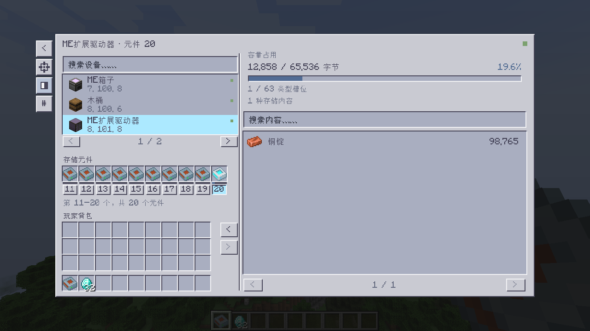

# 0.3.0 连续左键与终端外观 / Rapid clicks and terminal appearance

本轮修复用户报告的快速连续左键取出／放回存储元件时无响应，并调整终端外观。运行平台仍是 **Minecraft 1.20.1 Forge**。旧版 [0.2.0 记录](RELEASE_0.2.0.md) 保留，不把旧测试结果作为新修复已经通过的证据。

This iteration addresses ignored rapid left-click pickup/reinsertion and changes the terminal appearance. The runtime remains **Minecraft 1.20.1 Forge**. The historical [0.2.0 report](RELEASE_0.2.0.md) does not establish that the new fix has passed.

## 原因与交互变化 / Cause and behavior

Minecraft 将同一槽位上的快速连续左键识别为双击，其中一部分经过 `PICKUP_ALL` 路径。旧版远程元件操作拦截了该路径，因此普通左键的“取出、放回”序列可能丢掉后一次点击；这不是 Shift 操作问题。

本版对远程元件槽位的该事件按一次普通取放处理，并保持客户端预测与服务端解释一致；仍保留设备切换期间的校验和不支持的拖动分配限制。快速切换设备的确认处理也缩短了等待。网络协议更新为 **3**，**客户端和服务器必须一同升级到 0.3.0**。

Minecraft classifies sufficiently rapid repeated left clicks as double-click interactions using `PICKUP_ALL`. The previous remote-cell gate rejected that path, swallowing part of a normal pickup/reinsertion sequence. This was not a Shift-click issue. The updated handling treats the affected remote-cell event as a normal single-slot pickup on both sides while retaining selection checks and unsupported-drag restrictions. Protocol **3 requires upgrading both client and server**.

## 界面变化 / Appearance

紧凑布局参考 AE2 1.21.1 终端的灰色斜面边框、凹陷槽位与侧边工具栏。界面通过本模组原创代码绘制，没有复制新版 AE2 的界面纹理。返回、定位、主题及排序保留；默认浅色，已有主题偏好继续生效。此处的 1.21.1 仅指外观参考版本。

The compact layout takes inspiration from AE2's 1.21.1 terminal: gray beveled borders, recessed slots and a side toolbar. Original drawing code is used rather than copied newer AE2 GUI textures. Back, Locate, Theme and Sort remain available; light is the default and saved preferences are preserved. The 1.21.1 reference describes appearance only.

外观参考：[AE2 1.21.1 官方终端指南](https://guide.appliedenergistics.org/1.21.1/items-blocks-machines/terminals)、[官方终端布局定义](https://github.com/AppliedEnergistics/Applied-Energistics-2/blob/1.21.1/src/main/resources/assets/ae2/screens/terminals/base_terminal.json) 与 [官方界面配色定义](https://github.com/AppliedEnergistics/Applied-Energistics-2/blob/1.21.1/src/main/resources/assets/ae2/screens/common/palette.json)。

## 本轮验收状态 / Validation status

2026-09-30（Asia/Shanghai），已在 Java 17、Minecraft 1.20.1、Forge 47.4.0、AE2 15.4.10、GuideME 20.1.7，实际安装 ExtendedAE 1.20-1.4.21-forge 与 Glodium 1.20-1.5-forge 的环境完成服务端验证。`work/v030-eae-tests.log` 记录 **BUILD SUCCESSFUL、12 项真实 GameTests 全部通过且无附属跳过**；5 项 JUnit 通过。实际客户端已通过快速鼠标事件、持物工具栏、原有操作及十张新界面截图验收；无附属基线构建也已完成，详见下文。

The addon-enabled server run completed on 2026-09-30 with Java 17, Minecraft 1.20.1, Forge 47.4.0, AE2 15.4.10, GuideME 20.1.7, ExtendedAE 1.20-1.4.21-forge and Glodium 1.20-1.5-forge. It recorded **a successful build, all twelve real GameTests passed with no addon skips, and five passing JUnit tests**. The actual client passed rapid mouse events, held-cell toolbar gestures, existing interactions and ten new interface captures. The addon-absent baseline build also completed, as detailed below.

| 项目 / Check | 内容 / Coverage | 状态 / Status |
|---|---|---|
| 真实快速左键 / Real rapid left clicks | 普通驱动器与 ExtendedAE 第 20 槽各 6 对快速点击，共 12 对／24 次左键 / Six pairs per drive, twelve pairs and twenty-four left clicks total | 通过 / Passed |
| 同步与完整性 / Synchronization and integrity | 每次点击的鼠标持物与槽位状态；最终服务端实际槽位、元件总数和 12,345 铁锭／98,765 铜锭 / Immediate cursor/slot state and authoritative quantities | 通过 / Passed |
| 持物点击工具栏 / Toolbar while carrying a cell | 持元件切换主题、在界面外释放鼠标，再放回；确认主题确实切换且没有元件掉落 / Real theme activation, outside release, reinsertion and no dropped cells | 通过 / Passed |
| 服务端快速交互 / Server rapid interaction | 30 对取放、相邻元件不被收集、保护事件、失效设备与重复全量扫描约束 / Thirty pairs, no neighboring-cell collection, protection/stale checks and no redundant full scans | 通过 / Passed |
| 存储兼容回归 / Storage compatibility regression | 前版 11 项真实存储测试：元件、双箱、方向容器、流体缓冲器及 ExtendedAE 驱动器／总线 / Eleven existing live-storage cases | 通过 / Passed |
| 其他客户端回归 / Other client regression | 普通及 Shift 取放、中文搜索、设备快速切换 / Standard/Shift transfers, localized search and navigation | 通过 / Passed |
| 新界面 / New interface | 深浅主题与紧凑窗口实际截图 / Real light/dark and compact captures | 通过 / Passed |
| 无附属基线 / Addon-absent baseline | 正常构建、5 项 JUnit、9 项实际 GameTests；3 项附属测试明确跳过 / Build, five JUnit tests, nine executed GameTests and three explicit addon skips | 通过 / Passed |

最终无附属运行 `work/v030-baseline-build.log` 于 2026-09-30 17:01（Asia/Shanghai）完成，记录 `BUILD SUCCESSFUL`。Forge 显示 12 项完成，其中 **9 项实际测试通过，3 项明确跳过**（流体缓冲器 1 项、ExtendedAE 驱动器／总线 2 项）；不是在没有附属时声称完成附属测试。最终 JUnit XML 记录 5 项通过。

The final addon-absent run completed successfully at 17:01 on 2026-09-30 (Asia/Shanghai). Its twelve Forge completions consist of **nine executed passes and three explicit skips**: one fluid-buffer case and two ExtendedAE drive/bus cases. This does not claim addon coverage without the addons. Final JUnit results show five passing tests.

新增快速点击测试调用实际 `ControllerScreen.mouseClicked` 与 `mouseReleased`，每一对点击在 250 ms 内完成，从而经过原版双击状态处理；它不直接构造两次取放包来代替鼠标事件。先执行该项，再运行原有包级取放回归。每个槽位结束后等待同步，核对真实服务端库存，确认元件唯一且内容不变。

The new regression invokes actual screen mouse-press/release methods, with each pair under 250 ms, exercising vanilla double-click state. It does not substitute handcrafted pickup packets for mouse events. It runs before existing packet-route checks, then verifies the authoritative physical slot, unique cell count and unchanged contents after synchronization.

测试仅允许名为 `SmokeTest` 的一次性存档，开发运行目录与玩家使用的演示实例隔离。不能对正在游玩的演示存档或重要存档运行自动测试。测试开始前仅清理该一次性区域重建设备产生的旧物品实体并建立零掉落基线；操作后仍严格要求没有新元件掉落。

The harness accepts only a disposable world named `SmokeTest`; the development run directory is separate from the user's interactive demo. Do not run automated tests against an active demo or valuable world. Before interaction, only old item entities from rebuilding the disposable fixture are cleaned to establish a zero-drop baseline; the post-gesture check still requires no new dropped cells.

多人并发、领地保护及大型整合包性能仍需另行验证；本次未自动承诺这些兼容性。

Concurrent multiplayer, claim protection and large-modpack performance require separate verification.

## 客户端证据与截图 / Client evidence and captures

最终 `work/v030-client.log` 记录客户端构建及运行成功。普通驱动器第 1 槽与 ExtendedAE 第 20 槽分别完成 6 对真实快速左键，客户端和服务端一致保留一个元件，内容分别为 **12,345 铁锭、98,765 铜锭**。两种槽位均通过持物点击工具栏及拖到界面外释放测试，没有元件掉落。原有普通／Shift 取放、中文“铜锭”搜索和快速设备切换也通过。

The final client run succeeded. Six rapid real left-click pairs each on ordinary slot one and ExtendedAE slot twenty preserved one cell with **12,345 iron and 98,765 copper**, with client/server agreement. Both also passed held-cell toolbar and outside-release checks without dropped cells. Standard/Shift transfers, localized copper search and rapid device switching passed.

截图来自实际 1280×720 客户端，包含深浅主题、普通与扩展驱动器、流体、外部容器及紧凑窗口；最终截图包含文字对比度调整。详见 [客户端结果](screenshots/v0.3.0/client-smoke-result.txt)。

All ten images are real 1280×720 client captures, including light/dark themes, ordinary/expanded drives, fluids, external storage and compact layouts. They include the final text-contrast adjustments. See the [client result](screenshots/v0.3.0/client-smoke-result.txt) and [interaction-check log](screenshots/v0.3.0/client-smoke-checks.txt).

正式 JAR 已检查为 0.3.0，不含自动客户端测试入口、游戏测试类、空测试结构或捆绑的 AE2／ExtendedAE 类。浅色第 20 个元件、紧凑浅色与深色元件截图已人工复核，未发现重叠或数量文本对比度问题。

The production JAR was checked as version 0.3.0 with no client smoke harness, GameTest classes, empty test structure or bundled AE2/ExtendedAE classes. Manual review of light expanded-cell, compact-light and dark-cell captures found no overlap or quantity-text contrast problems.



[深色第 20 个元件](screenshots/v0.3.0/smoke-dark-expanded-cell20.png) · [紧凑浅色](screenshots/v0.3.0/smoke-compact-light.png) · [紧凑深色](screenshots/v0.3.0/smoke-compact-dark.png)

[浅色全网](screenshots/v0.3.0/smoke-light-network.png) · [深色全网](screenshots/v0.3.0/smoke-dark-network.png) · [驱动器](screenshots/v0.3.0/smoke-dark-drive.png) · [普通元件](screenshots/v0.3.0/smoke-dark-cell.png) · [流体](screenshots/v0.3.0/smoke-dark-fluid.png) · [外部容器](screenshots/v0.3.0/smoke-dark-external.png)

## 隔离复现 / Isolated reproduction

使用 JDK 17；可选兼容依赖保留官方文件名 `ExtendedAE-1.20-1.4.21-forge.jar` 和 `Glodium-1.20-1.5-forge.jar`。PowerShell 调用 `.bat` 时，将带路径值的完整 `-P` 参数加引号：

Use JDK 17 and the official addon filenames above. In PowerShell, quote each complete `-P` argument containing a path when invoking the batch wrapper:

```powershell
.\gradlew.bat test runGameTestServer '-PrunDir=../../work/run-v030' -PeaeTest '-PcompatModsDir=C:/path/to/compat-jars'
```

实际客户端验收使用隔离运行目录内的一次性 `saves/SmokeTest` 存档，设置简体中文后启动：

For client validation, prepare a disposable `saves/SmokeTest` world in the isolated run directory, select Simplified Chinese, and launch:

```powershell
.\gradlew.bat runClient '-PrunDir=../../work/run-v030' -PsmokeTest -PeaeTest '-PcompatModsDir=C:/path/to/compat-jars'
```

此命令会执行修改测试库存的自动流程并退出，不能替代交互演示启动命令。

This command mutates test inventories and exits automatically; it is not the interactive demo launch command.
