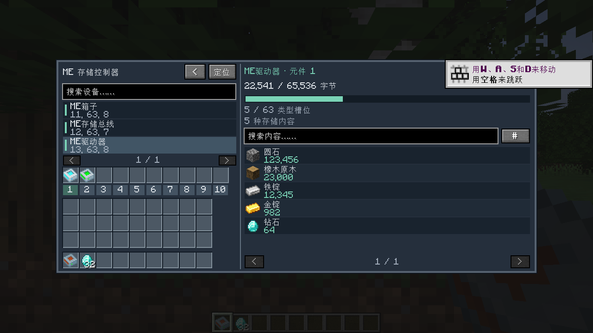

# 0.1.0 测试记录 / Validation record

日期：2026-09-30（Asia/Shanghai）。环境：Windows 11、Java 17.0.20.1、Minecraft 1.20.1、Forge 47.4.0、AE2 15.4.10、GuideME 20.1.7。

## 已通过

- `gradlew build`：Java 编译、资源处理、JAR 重映射、源代码 JAR、JUnit 全部成功。存在上游 API 弃用提示，无编译错误。
- 5 项 JUnit：重复节点／挂载去重，网络缓存读取，销毁节点拒绝访问，故障存储提供者隔离，内容读取异常隔离。
- 2 项真实 Forge 服务端 GameTests：供电和频道可用的控制器接入，驱动器精确读取 12,345 个铁锭，ME 箱子读取 23,456 mB 水，64k 元件字节开销与类型计数，ME 箱子输入槽和元件槽分离，元件取出／放回后保存内容，设备移除后立即失效；存储总线连接木桶的 37 个金锭及 1/27 槽位占用。
- 实际单人开发客户端，1280×720、GUI 缩放 2、简体中文：全网、驱动器、元件、流体和外部存储界面均成功打开和截图。通过正常客户端网络包执行普通取出、放回、Shift 取出、Shift 放回，确认元件总数仍为 1、内部铁锭仍为 12,345。
- 已检查实际界面截图，文本、图标、进度条和槽位未见重叠或溢出。Minecraft 初次游玩教学提示出现在部分截图右上角，属于原版游戏提示。

## 截图

[全网概况](screenshots/smoke-network.png) · [驱动器](screenshots/smoke-drive.png) · [流体元件](screenshots/smoke-fluid.png) · [外部木桶](screenshots/smoke-external.png)

## 尚未验证的范围

- 双客户端同时操作同一元件、网络高延迟、大型整合包压力测试。
- 各个第三方大容量／无限／虚空元件、自定义存储类型及领地保护模组。
- 手动确认高亮效果、频道耗尽恢复、区块卸载重载、全部配方及采集方向组合。
- 当前 JAR 已完成 Forge 重映射；本次客户端和 GameTest 使用开发运行环境，未另外安装到用户原有游戏实例。

## 复现

使用 JDK 17：`gradlew.bat build runGameTestServer`。首次运行需要联网下载官方开发依赖。

开发客户端自动测试使用**一次性测试世界**：将游戏测试生成的 `run/world` 复制到 `run/saves/SmokeTest`，然后执行 `gradlew.bat runClient -PsmokeTest`。它会修改测试世界，在出生位置附近创建设备，检查元件操作、截图并退出。不要使用重要存档作为 SmokeTest。结果默认写入项目相邻工作区的 `work/client-smoke`。测试入口及空结构不会打进安装用 JAR。

This beta passed five unit tests, two real Forge server GameTests, and a live integrated-client test with exact item/fluid counts and four cell-transfer operations. The screenshots are actual game captures. Cross-addon compatibility, concurrent multiplayer and claim-protection integration remain unverified. Production JAR remapping succeeded, but a separate packaged-instance launch was not performed.
